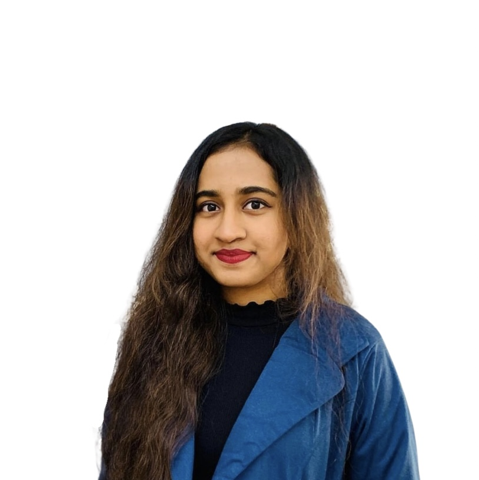

# Hi, I'm Tassen 👋

Sophomore CS student @ Boise State (Machine Learning emphasis).  
I enjoy exploring web development, NLP, and data analysis as I grow my skills.

---

## Skills
- **Languages/Tools:** Python, Java, SQL, HTML, React, Angular, Node.js, Git  
- **Focus:** Web scraping, NLP, data analysis  
- **Certs:** Web Scraping with Python; AI Workshop: Advanced Chatbot Development; Python Data Structures & Algorithms  

## Hackathons & Orgs
- Girls Who Hack  
- Red Hat & Intel AI Hackathon  
- WomenTech Network  
- Girls Who Code  
- Girls in Tech  
- AnitaB.org  

---

